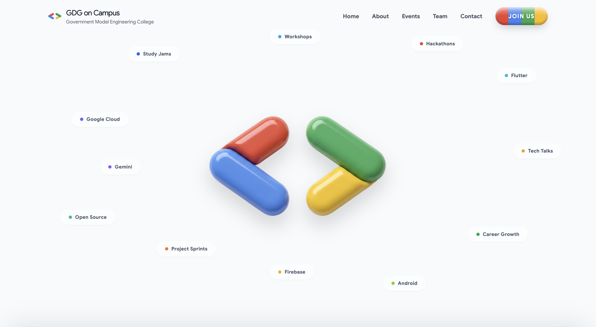

<p align="center">
  
</p>

# GDG on Campus — Landing Page


A modern, interaction-focused landing page designed for a **Google Developer Groups (GDG) on Campus** community.
Built to showcase community vision, programs, and events through **clean layout, subtle motion, and Google-inspired UI polish**.

## Visual Overview



🔗 **Live Demo:** [https://landing-page-pink-three-57.vercel.app](https://landing-page-pink-three-57.vercel.app)

---

## Overview

This project focuses on **UI clarity, motion discipline, and responsive behavior**, rather than heavy visuals or gimmicks.
Animations are intentional, minimal, and tied to user interaction — creating a calm but premium experience.

The design adapts cleanly across desktop and mobile while maintaining visual hierarchy and brand consistency.

---

## Design Goals

* Reflect **Google’s friendly yet professional design language**
* Keep motion **subtle, purposeful, and performance-safe**
* Maintain **visual breathing space** and readable structure
* Avoid over-animation or distracting effects
* Deliver a landing page that feels **official, not experimental**

---

## Key Features

* Fully responsive layout (desktop & mobile optimized)
* Hero section with subtle 3D-style breathing animation
* Floating pill elements on desktop with hover interaction
* Interactive logo pill in the welcome section
* Consistent hover feedback across buttons and cards
* Animated icons that respond on hover
* Google four-color hover scheme (blue, red, yellow, green)
* Clean footer with structured navigation and contact info

---

## UI / UX Notes

* Animations are applied **only to interactive elements**
* No continuous motion that distracts the user
* Desktop and mobile behaviors are handled separately where required
* Focus on spacing, alignment, and visual balance
* Designed to feel calm, modern, and trustworthy

---

## Tech Stack

* **React** (Vite + TypeScript)
* **Tailwind CSS**
* **Framer Motion**

---

## Getting Started

Clone the repository:

```bash
git clone https://github.com/azmil666/landing-page.git
cd landing-page
```

Install dependencies:

```bash
npm install
```

Run locally:

```bash
npm run dev
```

Build for production:

```bash
npm run build
```

---

## Project Status

This is a **design-focused project**, not a template library.
Future updates may include:

* Accessibility refinements
* Micro-interaction improvements
* Performance tuning
* Content extensibility for real GDG chapters

---

## AI Usage Disclosure

Google Gemini was used **only during early ideation** to:

* Explore button styles and UI concepts
* Brainstorm layout and visual direction

All final **design decisions, animations, and code** were manually implemented.

---
## Accessibility & Performance

- Semantic HTML structure for better readability
- Motion kept subtle to avoid user fatigue
- Responsive layouts tested across breakpoints
- Animations scoped to interactive elements only
---

## License

This project is licensed under the **MIT License**.
See the `LICENSE` file for full details.

---
